# Superstore Sales Report

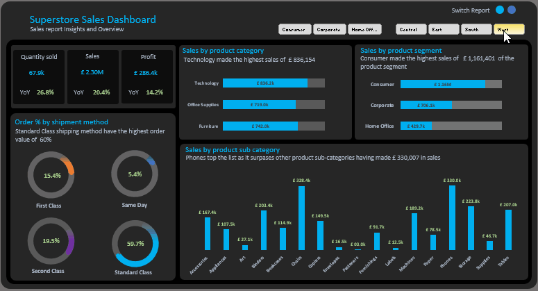

# Table of Contents

- [Project brief](#Project-brief)
- [Objective](#Objective)
- [Questions to Answer](#Questions-to-Answer)
- [Data source](#Data)
- [Tools](#Tools)
- [Dashboard design charts](#Dashboard-design-charts)
- [Development](#Developments)
- [Data Cleaning](#Data-Cleaning)
- [Data processing](#Data-processing)
- [Findings](#Findings)
- [Recommendations](#Recommendations)

## Project brief
Analyzed Superstore Sales Report with over £2.3M in sales data using an interactive dashboard.

## Objective

To identify top-performing product lines, customer segments, and shipping methods in order to maximize profit growth and streamline sales strategy.

## Questions to answer

-  What factors contributed to the YoY profit growth?

-  How does this quarter’s sales compare to the same period last year?

-  Which products or categories are dragging overall profitability down?

-  Why is Technology performing better than Office Supplies and Furniture?

-  What marketing efforts were done specifically for the Technology category?

-  Can we increase profit margins in Office Supplies or Furniture?

-  What made Phones the best-performing sub-category?

-  Are low-performing sub-categories worth keeping, or should they be removed or improved?

-  How do profit margins compare across the different sub-categories?

-  What strategies helped the Consumer segment outperform others?

-  How can we improve engagement with Corporate and Home Office segments?

-  Why do most customers choose Standard Class shipping over faster options?

-  Is there a cost-benefit to promoting Same Day or First Class shipping?

-  Do certain shipping methods result in higher customer satisfaction or repeat purchases?

-  Based on current trends, what will next quarter's top-selling sub-category likely be?

## Tools

| Tools | Purpose | 
| --- | --- | 
| Excel  |  Cleaning, Transformation, Processing and Visualization |

## Data

Here are the Data columns used in achieving project goal

-  KPIs
-  Product segment
-  Product category
-  Product sub-category
-  Shipping method
-  Region
-  City
-  Delivery duration
-  Monthly
-  Year 

## Dashboard design

Here is a list of appropriate chart visuals used in answering key questions.
-  Score cards
-  Column chart
-  Donut chart
-  Area chart
-  Progress Bar chart
-  Column chart
-  Line chart
-  Filter panel

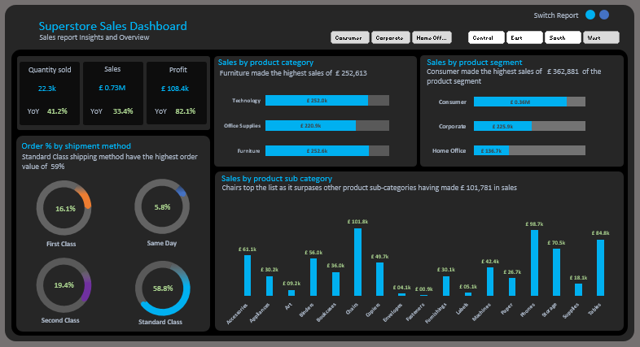

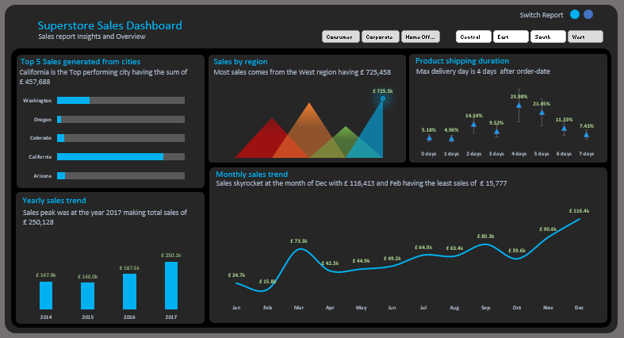

# Development

Here’s a step by step guide on how the data was approached 

-  Get data from source
-  Load to Excel
-  Clean and transform with Excel
-  Visualizations using Excel customized charts
-  Generate Insights
-  Give recommendations 

## Data Cleaning

The goal is to clean the dataset to ensure data integrity, accuracies and standardization.

- Only relevant columns will be retained.
- All data types should be appropriate for the contents of each column.
- No column contains null values, indicating complete data for all records.

## Processing 

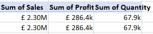

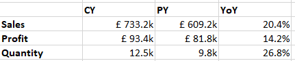

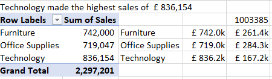

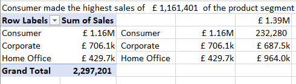

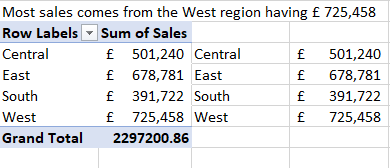

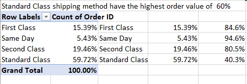

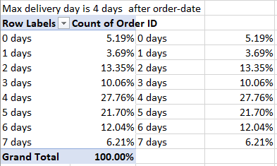

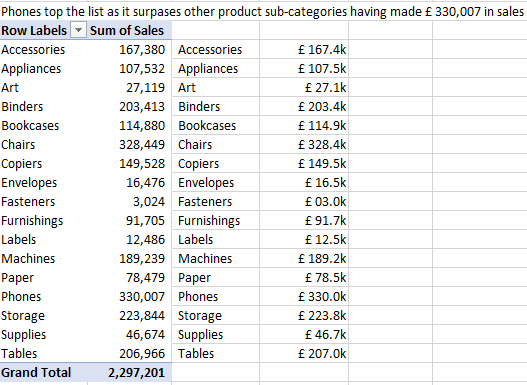

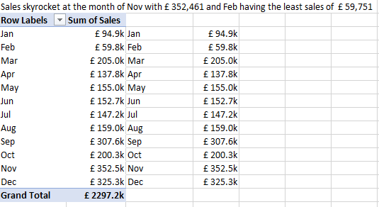

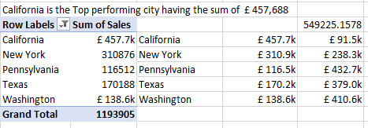

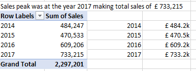

## Findings

-  Total Quantity Sold 67.9k units.

-  Total Sales of £2.30M

-  Total Profit of £286.4k

-  Year-over-Year (YoY) profit increased by 14.2% – a positive trend.

-  Technology had the highest sales of £836.1k

-  Office Supplies and Furniture followed with £710k and £742k respectively.

-  Phones led with £330k in sales.

-  Followed by Chairs £328.4k, Copiers £203.4k, and Accessories (£167.4k).

-  Consumers brought in the highest sales £1.16M, more than Corporate and Home Office.

-  Standard Class accounts for 60% of orders.

-  Same Day and First Class make up smaller shares 15.4% and 19.5%

## Recommendations

-  Focus more on Technology and Phone products – promote them in marketing and sales strategies.

-  Increase inventory for high-selling sub-categories like Phones and Chairs.

-  Since Consumers drive most sales, create exclusive offers or loyalty programs for them.

-  Since most orders are Standard Class, explore faster, low-cost shipping options to attract more Same Day or First Class users.

-  Investigate why categories like Home Office are low in sales – is it pricing, demand, or product mix?

-  Suggest accessories or furniture items when customers buy technology items like phones.

